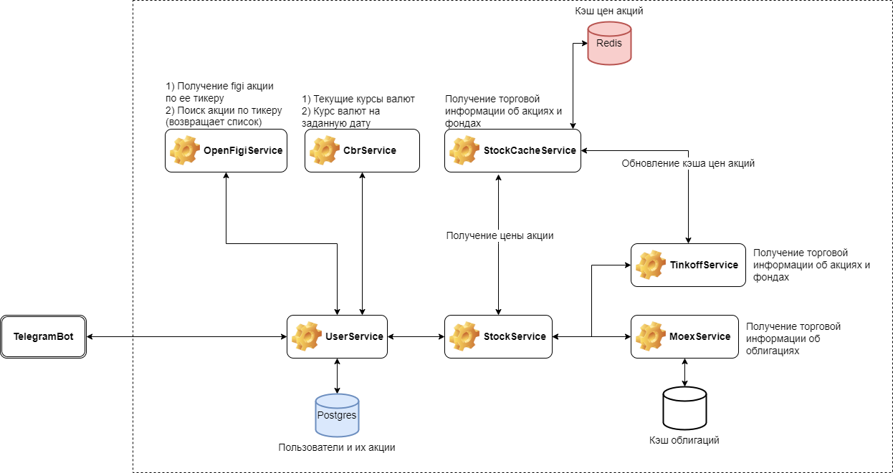
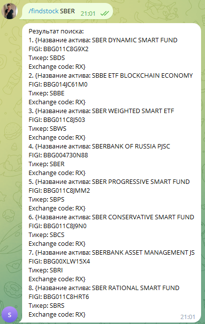
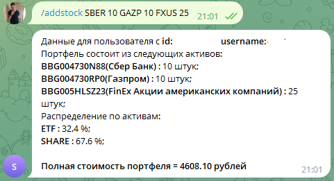

> ### Stock App
* Сбор актуальных данных о ценах на акции и облигации (Тиньков и Moex)
* Сбор данных о курсе валют ЦБ
* Поиск актива по его тикеру (OpenFigi)
* Аналитика портфеля(общая цена с учетом курса валют, распределение долей в портфеле по типу актива)
* Взаимодействие с приложением посредством Telegram бота

### Highlights
- Приложение построено на основе CQRS и Микросервисов
- FeignClient для взаимодействия между микросервисами
- Микросервис состоит из 2 модулей (api, service)

### Technology
- Spring Boot 3.0.1 и Java 17
- Spring Data JPA + PosgreSQL
- Spring Data Redis
- Spring OpenFeign
- Logback
- JUnit 5 + AssertJ для тестирования
- Docker
- GitHub actions в качестве CICD

### Getting started
Требуется Java 17 или выше

    ./gradlew bootRun

Или запустить с помощью Docker

    docker compose up

### Telegram Bot

Доступные команды

* /start - начало работы с ботом, регистрация пользователя по его chatId и username;
* /addstock - добавление актива по его идентификаторам (Ticker или FIGI). Данные вводятся в формате:
TICKER1 QUANTITY1 FIGI2 QUANTITY2. Пример: SBER 20 GAZP 31 RU000A0JS6M0 16.
* /portfolioinfo - просмотр информации о портфеле пользователя.
* /updatestock - обновление количества актива в портфеле пользователя по FIGI.
* /deletestock - удаление актива из портфеля пользователя по FIGI.
* /currency - выводит курс валют на текущую дату.
* /currency 30.01.2022 - выводит курс валют на указанную дату.
* /findstock - поиск актива по его Ticker.

